# PRACTICA 1 - SISTEMAS ORGANIZACIONALES Y GERENCIALES 2
**Integrantes**
* 202104160 Steven Facundo Mejía Xolop  
* 202200066 Helen Janet Rodas Castro  
* 201513656 Kimberly Julissa Estupe Chen  
* 202101499 Denis Augusto Coronado Calderon   
* 201801671 Neidy Aracely Flores Molina  

## PLANIFICACIÓN

## PROCESO DE ANALISIS

## METODOLOGIA
Las graficas de barras se utilizaron mas que todo para compara categorias y sub categorias.  
Tambien se utilizaron graficas de tendencias en el tiempo, las cuales representan la evolución en un periodo de tiempo. 
## RESPUESTAS
### 2. Análisis exploratorio
### 3. Análisis de tendencias
**a.1 Meses con Mayores y Menores Ventas**
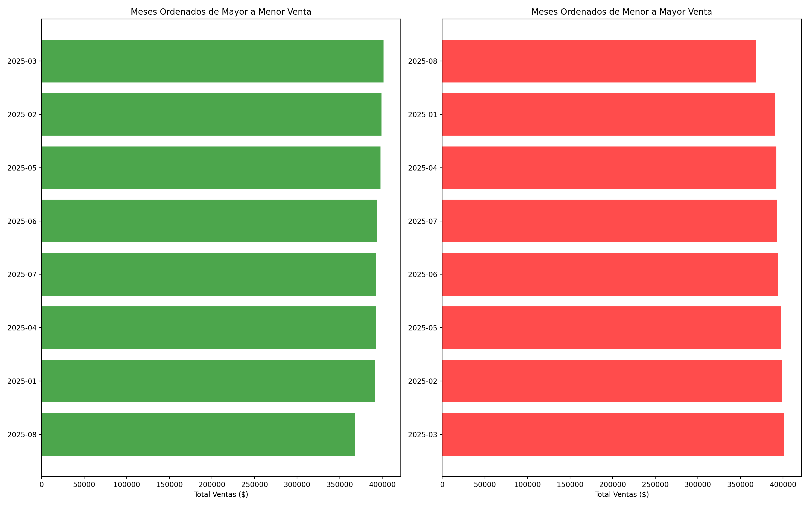  
Los meses mas vendidos han sido:
- Marzo: $401,440.85
- Febrero: $398,876.03
- Mayo: $397,741.42 

Mientras que los meses menos vendios fueron:
- Agosto: $368,046.58
- Enero: $390,879.97
- Abril: $392,076.93

Los meses mas vendidos reflejan un buen movimiento de entrada de estos meses. Por lo que seria recomendable crear campañas de marketing y promociones para aumentar aun mas las ventas de esos meses.

**b.1 Prodcutos Mas Vendidos**
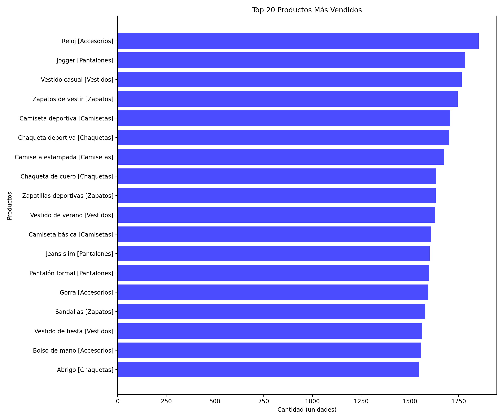 
Los producto mas vendidos fueron:
- Reloj [1,856 unidades]
- Jogger [1,782 unidades]
- Vestido casual [1,766 unidades]

Estas tambien viene a representar 3 tipos de categorias distintas entre si, ya que el reloj es de accesorio, el jogger de patalones y el ultimo entra en categoría de vestidos.
De estos se puede decir que tiene muy buena aceptacion en el mercado y tienen precios competitivos que llaman la atención de los clientes ya que pueden ser de uso diario.

**b.2 Prodcutos Menos Vendidos**
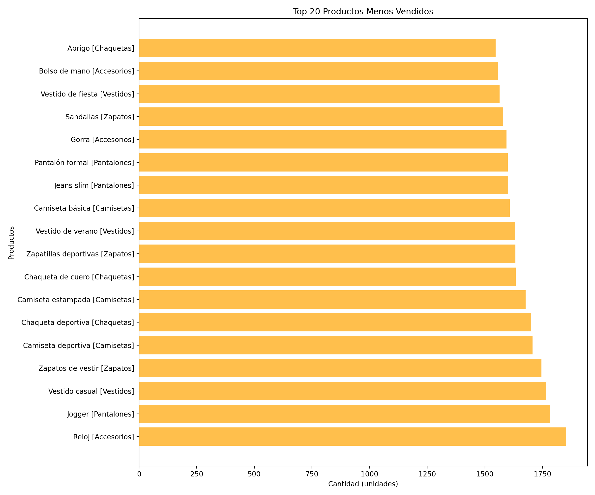 
Por otro lado tenemos los producto menos vendidos:  
- Abrigo [1547 unidades]
- Bolso de mano [1556 unidades]
- Vestido de fiesta [1564 unidades]  

Por otro lado tenemos que los abrigos que estan en la cateogira de chaquetas son los productos que menos movimiento tienen. Segido de cerca por los bolsos de mano que son accesorios y los vestidos de fiesta.

Lo interesante de esto es ver que aunque los vestido causales estan entre los mas vendidos, los vestido de fiestas son de los menos venidos.  
Lo mismo se puede decir de los relojes que son accesorio al igual que los bolsos de mano.  

### 4. Segmentación de clientes 
**a.1 Productos más vendidos segmentados por edad**
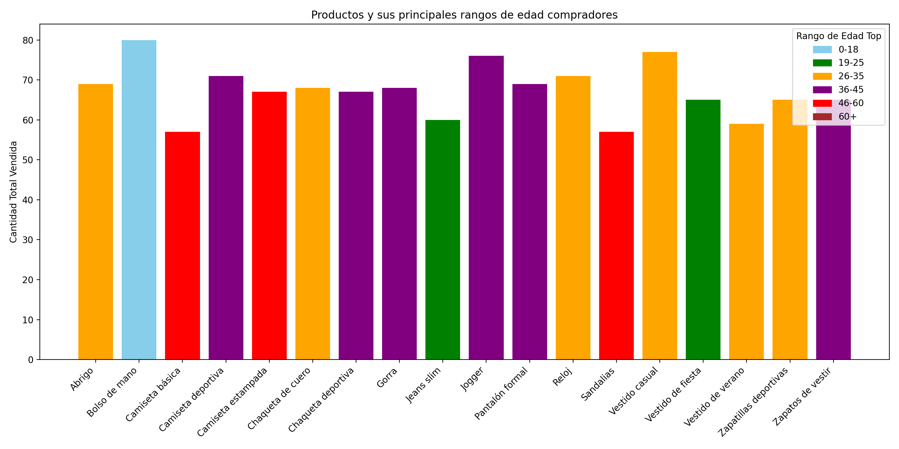

**a.2 Poder de compra de grupos segmentados por edad**
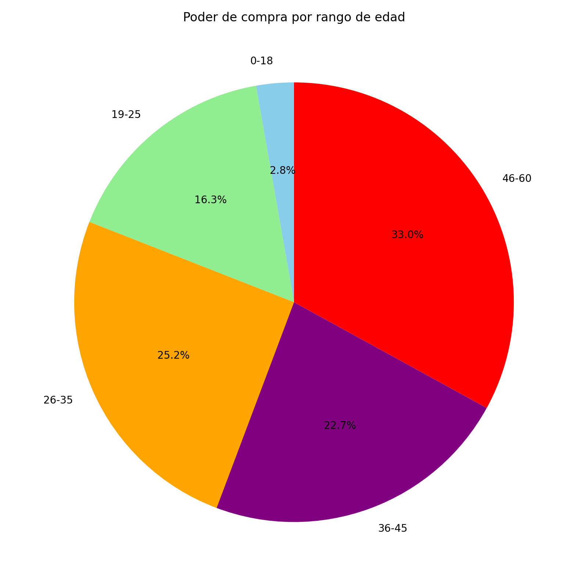

**b.1 Comparación de comportamiento de compras por género y producto**
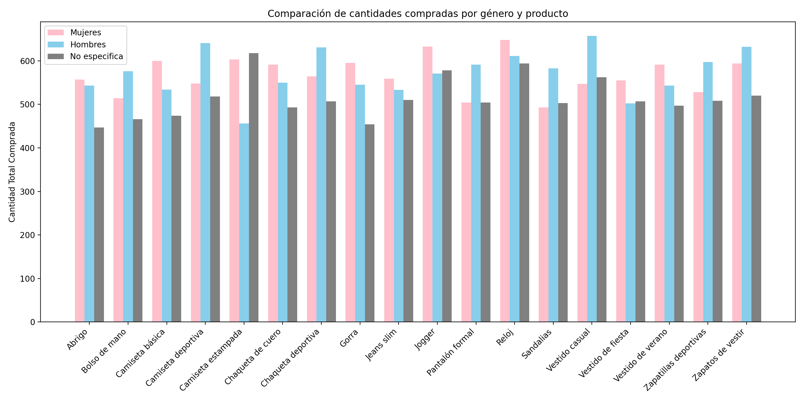

**b.2 Comparación de comportamiento de compras total por género**
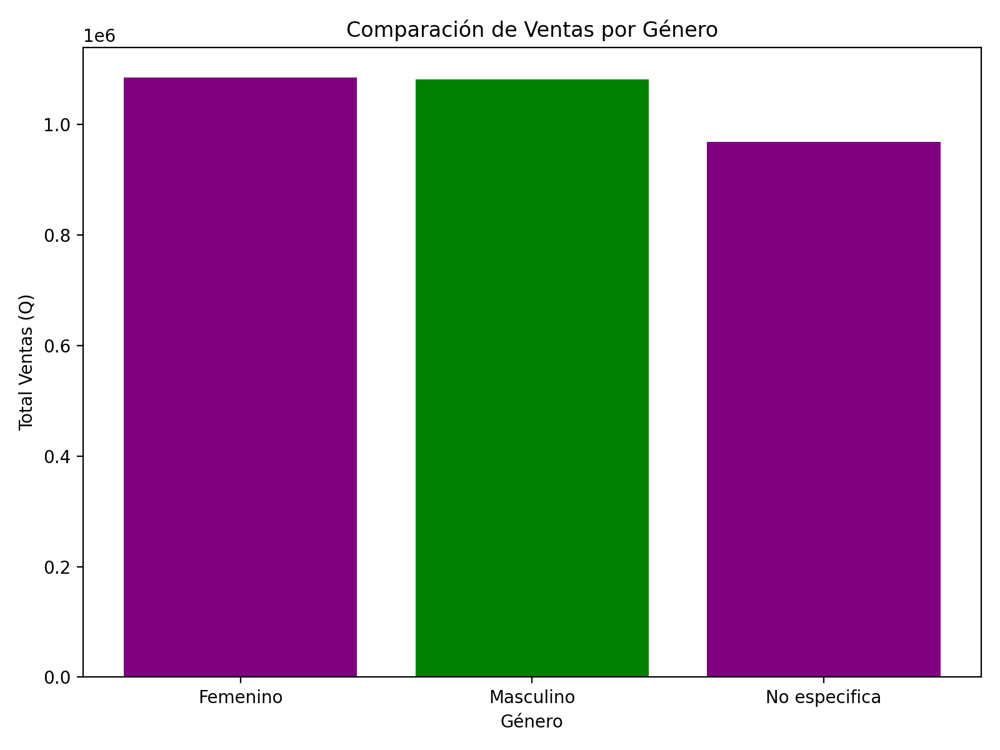

### 5. Análisis de correlación 
### 6. Visualización de datos: 
**i. Productos vendidos por mes y región**  

**ii. Precios promedio de productos por categoría**  

**iii. Cantidad de productos por categoría**  

**iv. Cantidad de productos por rango de precios y categoría**  
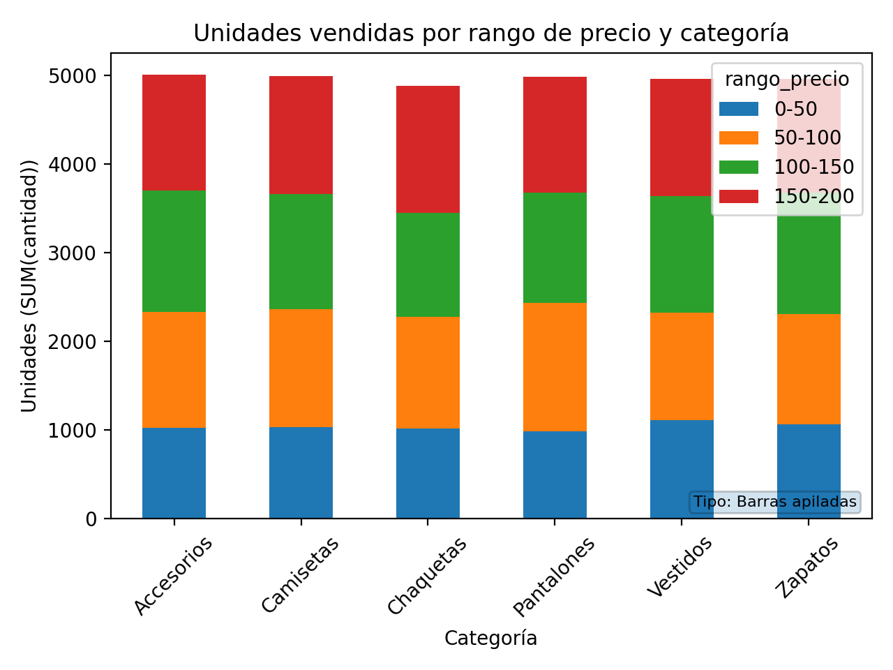  

**v. Cantidad de ventas realizadas por género y mes**  
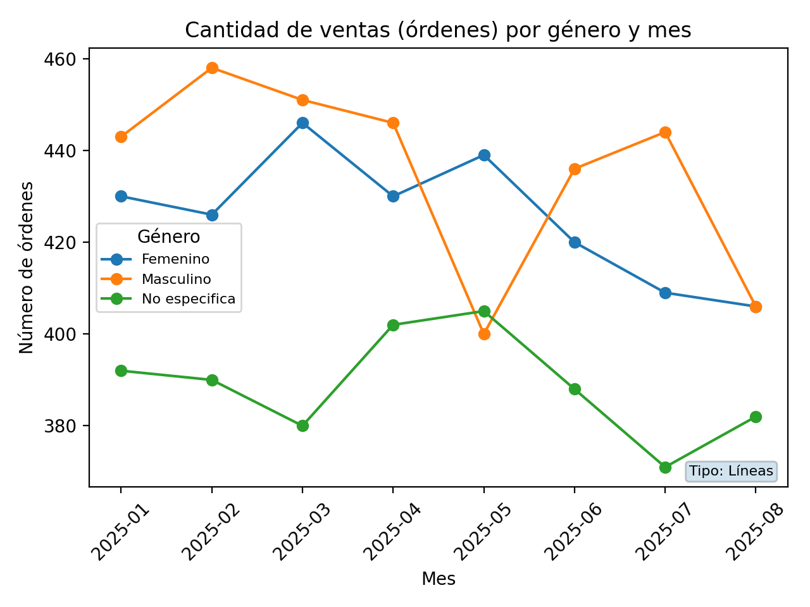

**vi. Cantidad de ventas realizadas por método de pago y categoría**  
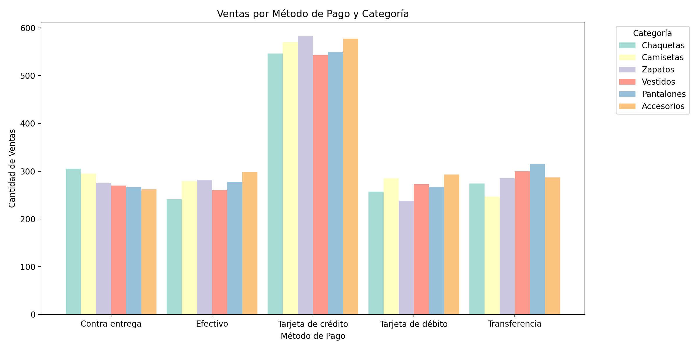  
Se puede observar que la mayoría de clientes prefieren utilizar la tarjeta de crédito como método de pago, sin importan la categoría, esto podría deberse a la facilidad de uso que tiene. Mientras el resto de métodos de pago se mantiene muy cercanos entre si.  

**vii. Promedio del total de la compra por edad** 
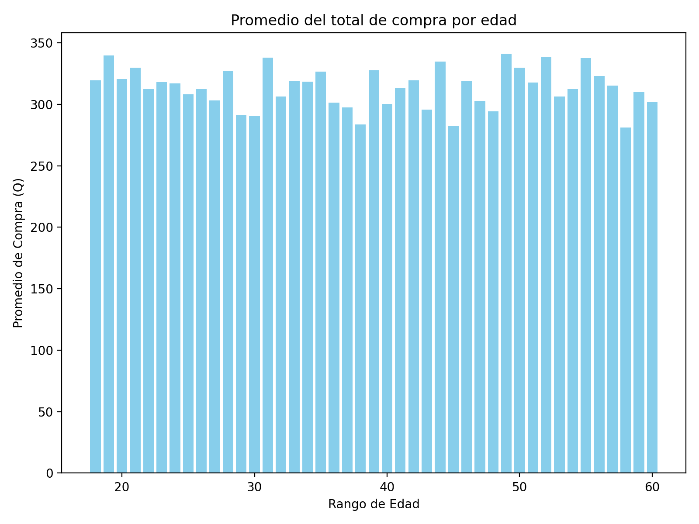

## 7. CONCLUSIONES Y RECOMENDACIONES
### Conclusiones

### Recomendaciones

## 8. PREGUNTAS
**a. ¿Cómo podrían los insights obtenidos ayudar a diferenciarse de la competencia?**  

**b. ¿Qué decisiones estratégicas podrían tomarse basándose en este análisis para aumentar las ventas y la satisfacción del cliente?**  

**c. ¿Cómo podría este análisis de datos ayudar a la empresa a ahorrar costos o mejorar la eficiencia operativa?**  

**d. ¿Qué datos adicionales recomendarían recopilar para obtener insights aún más valiosos en el futuro?**  

**e. ¿Qué categorías de producto generan mayor ingreso promedio por orden y cómo impacta esto en la estrategia comercial?**  
La categoria de chaquetas es la que mas ingresos en promedio por orden genera, aunque la diferencia con el resto de las categorias es pequeña. Se podria integrar el resto de categorias en esperiencia de compra. 
Al realizar la compra de un objeto se le podria brindar al cliente sugerencias de comprar de otros produtos.

**f. ¿Existen clientes recurrentes y qué porcentaje de las ventas totales representan?** 

**g. ¿Existen diferencias significativas en el ticket promedio entre regiones de envío?** 

**h. ¿El método de pago influye en el valor total de la orden? Analice si ciertos métodos están asociados a tickets más altos.** 

**i. ¿Todas las categorías presentan el mismo comportamiento estacional o alguna es más sensible a ciertas épocas del año?**

**j. ¿Un pequeño grupo de productos concentra la mayor parte de las ventas (principio de Pareto 80/20)?** 